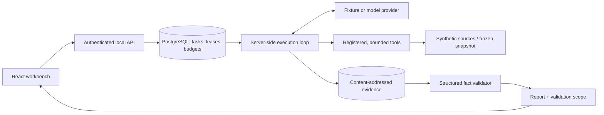
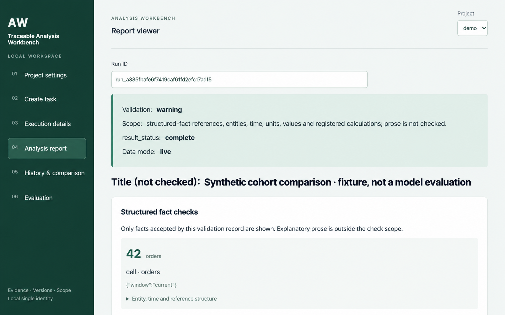

# Traceable Analysis Workbench

**English** | [简体中文](README.zh-CN.md)

A local analysis workbench that binds an agent to versioned instructions and tools, archives evidence, and checks the structured facts in its reports.



## Core mechanisms

- **Version binding.** Each run records Skill, catalog, tool, code and environment digests. Execution checks the saved bindings before dispatch and acceptance.
- **Evidence archive.** Accepted results are immutable, content-addressed objects. Reports reference exact evidence cells, entities, time windows and units.
- **Fact checks with an explicit boundary.** The validator checks references, coverage, units and registered arithmetic. `valid` is a structural check, not a claim that the analysis or prose is correct. The UI separates checked facts from unverified text.
- **A server-side execution loop.** Workers assemble bounded context, reserve budgets and record model intent before calling a provider. Leases and epochs fence stale workers; uncertain responses remain visible for explicit reconciliation.
- **Queryable frozen snapshots.** The synthetic commerce adapter can query checksummed Parquet through DuckDB with external access disabled. Saved evidence replay and frozen re-execution are different operations. Point-in-time availability reconstruction is unsupported.
- **Daily cutoffs.** An optional protocol requires an immutable daily decision before later dates become visible. Follow-up reviews append records rather than rewriting the prior decision.

Three independent public scenarios are included: commerce cohorts, service operations, and data quality. Their data is synthetic. The no-key demonstration uses commerce and a deterministic fixture provider; it is not a model evaluation.

The same engine has also been exercised with a private financial-data adapter, which is not included in this repository.

## Quick start

Tested preparation environment: macOS arm64, Python **3.12.14**, Node **24.19.0**, npm **10.9.3**. Python 3.12 and Node 22+ are the intended prerequisites; other platforms are not certified. No Docker or API key is needed for the local demo.

From this checkout:

```sh
python3.12 -m venv .venv
.venv/bin/python -m pip install pip==25.0.1 setuptools==75.8.0 wheel==0.45.1
.venv/bin/python -m pip install -r requirements.lock
.venv/bin/python -m pip install --no-deps --no-build-isolation -e .
npm --prefix apps/web ci --ignore-scripts --no-audit --no-fund
npm --prefix apps/web run build
./scripts/demo.sh --fixture-only
```

Or run `./scripts/demo.sh --fixture-only` after installing the Python/Node/npm prerequisites: it creates a missing `.venv`, installs locked dependencies, builds the UI, creates a disposable PostgreSQL instance, runs **create → server-side execution → report publication**, and opens [the local workbench](http://127.0.0.1:8912). Use the history view to select the new run. Creating another task in the UI queues it for the local fixture worker. Stop with **Ctrl-C** to shut down services and delete demo state, evidence and the local token.

All browser assets are bundled locally. A local gateway reads the API credential from a private file; the credential is never embedded in frontend JavaScript. The demo exposes only loopback ports. It does not connect to an existing database.

If a provider key is configured and `DEMO_REAL_CONFIG` points to an explicit model/rate/budget configuration, omitting `--fixture-only` appends one real-model run after the fixture. Keys are read only by the provider from environment variables. No paid request occurs with `--fixture-only`. See [the optional model and container instructions](docs/release/DEMO.md).

## Demo

[English translation](docs/release/media/report.en.png) | [中文原始截图 / Original Chinese screenshot](docs/release/media/report.png)



This is an AI-translated documentation image of the original screenshot. The application UI is currently Chinese; English UI localization is not implemented.

[Watch the local interface demonstration (Chinese UI)](docs/release/media/demo.mp4). It shows configuration, task creation, execution, report inspection, comparison and the evaluation empty state. All displayed data is synthetic; fixture telemetry must not be read as model performance.

## Evaluation results

A locked, one-shot synthetic experiment completed **225/225 planned trials**: 27 tasks across nine families, with separate injection probes. Failed analyses stay in the denominators.

| Condition | Correct / planned | Completion |
| --- | --- | --- |
| Fixed query flow + template | 27 / 27 | 100.0% |
| Grok with generic instructions | 27 / 81 | 33.3% |
| Grok with scenario Skill | 32 / 81 | 39.5% |
| DeepSeek with scenario Skill | 11 / 27 | 40.7% |

### What the results show

**This benchmark favors exhaustive querying.** Each scenario exposes only two or three tools, and the fixed procedure invokes all of them on every trial: mean tool calls are 3.00 for commerce, 2.00 for service operations and 2.00 for data quality. It therefore collects all evidence available through these task contracts. There are no tasks with many optional investigation dimensions that make exhaustive querying impractical—the setting where adaptive tool selection might help. This experiment measures reliability on small tasks that can be exhaustively queried; its design favors the fixed procedure.

**The observed Agent failures mainly concern insufficient investigation and incorrect judgments, rather than numerical errors in the matched published facts.** Across the 108 A1 holdout trials, there were 110 tool calls (mean 1.02) and 237 model calls (mean 2.19), despite budgets of six tool calls and six model calls per trial. A1-Grok averaged 1.01 tool calls and 2.21 model calls; `required_followup_missing` occurred in 26/81 trials. Published facts that matched a necessary entity and column passed the evidence-bound fact checks and agreed with the independent reference values: 102/102 for A1-Grok and 48/48 for A1-DeepSeek (both 100%). This is a restricted denominator: missing facts, wrong entities or columns, rejected/unpublished reports, and unverified prose are not certified by that percentage. Omissions and incorrect classifications can still make a trial fail.

Next, follow-up investigation strategies need improvement and measurement on a new held-out task set; no such improvement or new evaluation has been performed.

Check the [measured results, per-trial receipts, costs and limitations](eval/results/b2/README.md). On these narrow tasks, the fixed procedure was more reliable. Grok + Skill improved by 6.17 percentage points over generic instructions (descriptive family-cluster 95% interval: 1.23 to 11.11 points; just nine families). This does not establish general superiority or transfer to other tasks.

Nine synthetic injection trials produced zero detected illicit proposals, blocked actions, or successes. Detection covers specific actions and a synthetic leakage marker; it does not certify absence of all disclosure. Total provider estimates including development were **1.960945 USD** and **0.845216 CNY**, with currencies kept separate. The evaluation uses live synthetic inputs, not product frozen reruns. Result receipts persist through the offline evaluation interface; the UI evaluation view remains an empty state.

## Limitations and unfinished work

- The **58 full acceptance criteria have not been executed**. Passing unit tests and bounded integration probes is not full acceptance.
- Remaining P8 authorization/security work and P9b operational work are not complete. This is a local, single-principal workbench, not a production deployment or security certification.
- The benchmark favors the fixed procedure: every task can be investigated with all two or three available tools. It does not test settings with many optional dimensions where exhaustive querying is impractical.
- Synthetic evaluation samples are small. Their results cannot establish performance on unrelated tasks.
- Fixture providers are deterministic test doubles. Recorded fixture token values and costs are not empirical model measurements.
- Queryable frozen execution is covered by finite synthetic checks; no broad second-backend equivalence campaign or historical knowledge reconstruction is claimed.
- The optional Compose files are supplied for review, but **container startup is NOT RUN** because Docker was unavailable on the preparation machine.
- Hidden reference answers are not shipped. Tests requiring those files remain NOT RUN in a clean public checkout; missing answers are never synthesized to manufacture a passing result.
- Dependency versions are pinned; cross-platform artifacts and a comprehensive supply-chain audit are not certified.

See [verification scope](docs/release/VERIFICATION.md) for exact commands, results and omissions, and [the release process](docs/release/RELEASING.md) for the offline packaging gate.

## License

Licensed under the [MIT License](LICENSE). Third-party dependencies retain their respective licenses.
