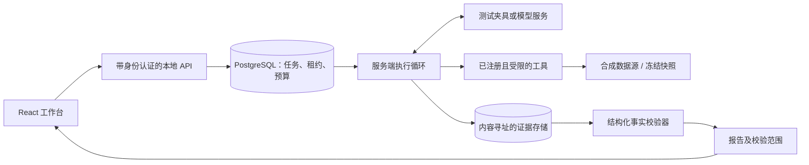
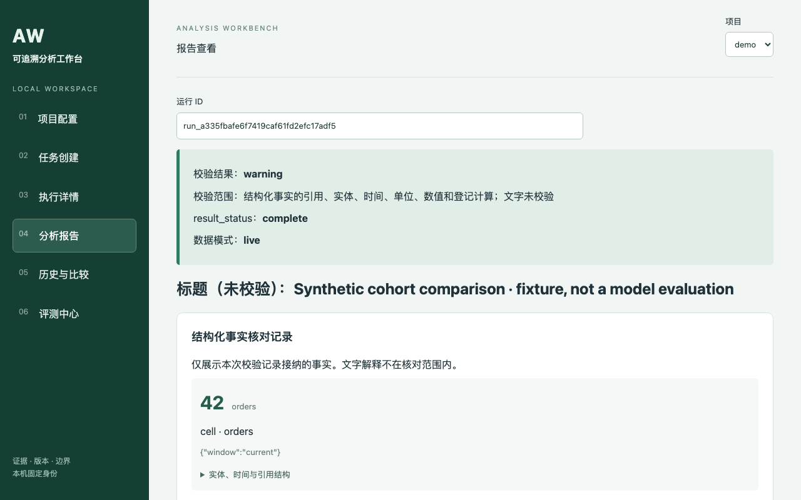

# 可追溯分析工作台

[English](README.md) | **简体中文**

一个在本机运行的数据分析工作台：为 Agent 绑定有版本记录的指令和工具，归档查询证据，并核对报告中的结构化事实。



## 核心机制

- **版本绑定。** 每次运行记录 Skill、目录、工具、代码和环境的摘要；在执行派发和结果接纳前，核对已保存的版本绑定。
- **证据归档。** 已接纳的结果保存为不可变的内容寻址对象。报告精确引用证据中的单元格、实体、时间窗口和单位。
- **明确校验边界。** 校验器检查引用、覆盖范围、单位和已登记的算术计算。`valid` 表示结构性校验通过，不代表分析结论或文字正确。界面将已核对事实与未经校验的文字分开展示。
- **服务端执行循环。** Worker 组装有大小限制的上下文，预留预算，并在调用模型服务前记录调用意图。租约和 epoch 防止过期 Worker 接纳结果；结果不确定的调用会保留记录，等待显式核对处理。
- **可查询的冻结快照。** 合成电商适配器可以通过 DuckDB 查询经过校验和核对的 Parquet，并禁用外部访问。回放已保存证据与在冻结数据上重新执行是两种不同操作。目前不支持重建历史时点的数据可获得性。
- **逐日截止机制。** 可选协议要求先保存不可变的当日决策，再开放后续日期的数据。后续复核追加新记录，不改写原有决策。

仓库包含三个独立的公开场景：电商群组分析、服务运营、数据质量，全部使用合成数据。无需密钥的演示采用电商场景和确定性的测试夹具，并非模型评测。

同一引擎也已用于一个私有金融数据适配器，该适配器不包含在本仓库中。

## 快速开始

已测试的准备环境：macOS arm64、Python **3.12.14**、Node **24.19.0**、npm **10.9.3**。预期前置条件为 Python 3.12 和 Node 22+；尚未验证其他平台。本地演示不需要 Docker 或 API 密钥。

在仓库目录中执行：

```sh
python3.12 -m venv .venv
.venv/bin/python -m pip install pip==25.0.1 setuptools==75.8.0 wheel==0.45.1
.venv/bin/python -m pip install -r requirements.lock
.venv/bin/python -m pip install --no-deps --no-build-isolation -e .
npm --prefix apps/web ci --ignore-scripts --no-audit --no-fund
npm --prefix apps/web run build
./scripts/demo.sh --fixture-only
```

也可以在安装 Python、Node 和 npm 后直接运行 `./scripts/demo.sh --fixture-only`：脚本会在缺少 `.venv` 时创建它，安装锁定的依赖，构建界面，创建临时 PostgreSQL 实例，执行**创建任务 → 服务端执行 → 发布报告**，然后打开[本地工作台](http://127.0.0.1:8912)。在历史页面选择新运行即可查看；在界面创建其他任务后，本地夹具 Worker 会处理队列。按 **Ctrl-C** 停止服务，并删除演示状态、证据和本地令牌。

浏览器资源全部在本地打包。本地网关从私有文件读取 API 凭证，凭证不会嵌入前端 JavaScript。演示仅开放回环地址端口，不连接已有数据库。

如果已配置模型服务密钥，且 `DEMO_REAL_CONFIG` 指向显式指定模型、计价和预算的配置，省略 `--fixture-only` 会在夹具运行之后追加一次真实模型运行。只有模型服务适配器会从环境变量读取密钥。使用 `--fixture-only` 不会产生付费请求。详见[可选模型与容器说明（英文）](docs/release/DEMO.md)。

## 演示

[中文原始截图](docs/release/media/report.png) | [英文翻译图](docs/release/media/report.en.png)



英文图由 AI 翻译原截图中的界面文字，仅用于文档说明；应用界面目前为中文，尚未实现英文界面。

[观看本地界面演示录像（中文界面）](docs/release/media/demo.mp4)。录像展示项目配置、任务创建、执行、报告查看、比较和评测空状态。所有展示数据均为合成数据；夹具的运行统计不能当作模型性能。

## 评测结果

一次方案锁定后执行的合成数据实验完成了 **225/225 次计划试验**，覆盖九个任务族的 27 道题，另有单独的注入探针。失败的分析仍计入分母。

| 条件 | 正确完成 / 计划次数 | 完成率 |
| --- | --- | --- |
| 固定查询流程 + 模板 | 27 / 27 | 100.0% |
| Grok + 通用指令 | 27 / 81 | 33.3% |
| Grok + 场景 Skill | 32 / 81 | 39.5% |
| DeepSeek + 场景 Skill | 11 / 27 | 40.7% |

### 如何理解这些结果

**这套题集有利于全量查询。** 每个场景只有两到三个工具，固定流程每次都会调用全部工具：电商场景平均调用 3.00 次，服务运营和数据质量场景均为 2.00 次。因此，它会收集任务约定下可以取得的全部证据。题集中没有可选调查维度很多、无法实际穷举查询的任务，而这类场景才可能体现动态工具选择的价值。本实验衡量的是在能够穷举查询的小任务上，谁更可靠；实验设计本身有利于固定流程。

**观察到的 Agent 失败主要是调查不足和判断错误，而非已发布且匹配必要事实的数字错误。** 在 108 次 A1 留出试验中，共调用工具 110 次（平均 1.02 次），调用模型 237 次（平均 2.19 次），而每次试验的预算允许六次工具调用和六次模型调用。A1-Grok 平均调用工具 1.01 次、模型 2.21 次；81 次试验中有 26 次出现 `required_followup_missing`（缺少必要补查）。已发布、且能匹配必要实体和列的事实，通过了证据绑定的事实核对，并与独立参考值一致：A1-Grok 为 102/102，A1-DeepSeek 为 48/48，均为 100%。这个分母有严格限制：遗漏的事实、错误的实体或列、被拒绝或未发布的报告，以及未经校验的文字，都不在该百分比的保证范围内。漏答和错误分类仍然会导致整次试验失败。

下一步需要改进补查策略，并在新的留出题集上重新测量；目前尚未实施这项改进或新的评测。

详见[实测结果、逐次试验记录、成本和局限（英文）](eval/results/b2/README.md)。在这些范围较窄的任务上，固定流程更可靠。Grok + Skill 相对通用指令提高了 6.17 个百分点（按任务族聚类计算的描述性 95% 区间为 1.23 至 11.11 个百分点；仅有九个任务族）。这不能证明普遍优势，也不能推断其在其他任务上的表现。

九次合成注入试验中，检测到的违规提议、被阻止的操作和成功违规次数均为零。检测仅覆盖特定操作和一个合成泄露标记，不能保证不存在任何形式的信息泄露。包含开发过程在内的模型服务估算费用合计为 **1.960945 USD** 和 **0.845216 CNY**，不同币种分别统计。评测使用 live 合成输入，并非产品的 frozen 重跑。结果记录保存在离线评测接口中；界面的评测页面仍为空状态。

## 局限与未完成事项

- **58 项完整验收尚未执行（NOT RUN）。** 单元测试和范围有限的集成探针通过，不等于完整验收通过。
- P8 剩余的授权与安全工作、P9b 运维工作尚未完成。这是本地、单一身份的工作台，不是生产部署，也不代表通过安全认证。
- 题集有利于固定流程：每道题都可以调用全部两到三个工具完成调查。它没有检验可选维度很多、穷举查询不现实的场景。
- 合成评测样本较少，结果不能证明在其他任务上的性能。
- 夹具服务是确定性的测试替身。夹具记录的 token 数和成本不是真实模型测量值。
- 可查询的冻结执行只经过有限的合成检查；没有完成广泛的第二后端等价性验证，也不支持重建历史知识状态。
- 提供了供审阅的可选 Compose 文件，但准备环境没有 Docker，因此**容器启动未执行（NOT RUN）**。
- 隐藏参考答案不随仓库发布。公开仓库全新检出后，依赖这些文件的测试仍为 NOT RUN；不会通过编造缺失答案来制造通过结果。
- 依赖版本已锁定，但尚未验证跨平台产物，也未完成全面的供应链审计。

具体命令、结果和未执行项见[验证范围（英文）](docs/release/VERIFICATION.md)；离线打包检查见[发布流程（英文）](docs/release/RELEASING.md)。

## 许可证

使用 [MIT 许可证](LICENSE)。第三方依赖保留各自的许可证。
