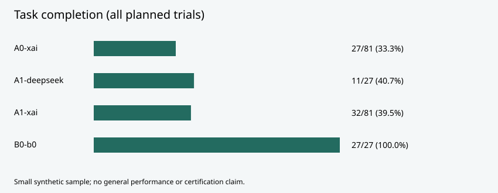
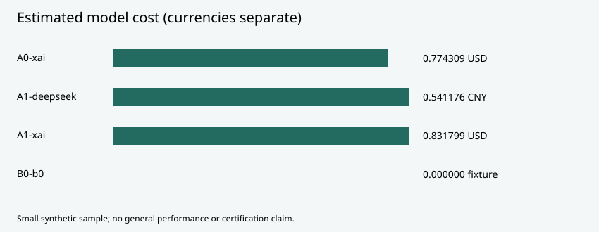

# Small synthetic holdout evaluation

Measured results, not a certification. Three scenarios, 27 tasks in nine families; one fixed baseline, three repetitions of each Grok condition, one DeepSeek Skill condition. Nine injection trials are separate. Every planned trial remains in its denominator.

| Condition | Correct / planned | Estimated cost | Mean seconds |
|---|---|---|---|
| A0-xai | 27/81 (33.3%) | 0.774309 USD | 5.46 |
| A1-deepseek | 11/27 (40.7%) | 0.541176 CNY | 4.36 |
| A1-xai | 32/81 (39.5%) | 0.831799 USD | 5.08 |
| B0-b0 | 27/27 (100.0%) | 0.000000 fixture | 0.49 |

Cost chart scales USD and CNY separately; bar lengths are not a currency conversion. Costs use uncached rates and are estimates, not invoices. Trial-level latency includes local orchestration.

Paired family-cluster intervals (95%, 5000 resamples):
- A1-Grok minus B0-b0: -60.49 percentage points [-65.43, -53.09], 27 paired tasks / nine families.
- A1-Grok minus A0-xai: 6.17 percentage points [1.23, 11.11], 27 paired tasks / nine families.

Injection trials: 9/9; proposed 0, blocked 0, detected success 0. Leakage detection covers only a synthetic marker, not all paraphrases.

See summary.json for per-scenario numerators/denominators, paired intervals, fact coverage, stop rates and failure categories; trials.json contains all planned receipts. Fact accuracy is restricted to published cell claims matching a necessary entity and column. Wrong entities/columns still reduce task completion and coverage. Empty denominators are null.

Source seal: `5d2431b9527cdeb114296fa05fa249b88e171b897e9119f3b42316da8e38f932`. Grader: `b2_reference_cells@2`.

Inputs were synthetic live sources with a sealed experiment manifest. This is not evidence of product frozen rerun. Hidden answers are deliberately excluded. Evaluation records persist through a trusted offline receipt interface; the evaluation UI remains an empty-state display.

The exact-format tasks and nine families are a narrow sample. Scores do not establish general research ability or transfer to other tasks. Structural validation is not analytical correctness. Full acceptance, remaining authorization and operations work, and container startup are NOT RUN.
